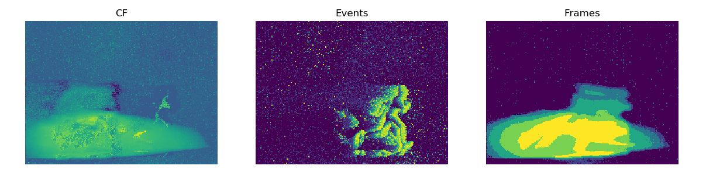

# pycomplementaryfilter

This is a Python/C++ implementation of the complementary filter described [in](https://www.cedricscheerlinck.com/continuous-time-intensity-estimation). 

To make it more generic to event-based vision, the filter receives Intensity events that can be either generated from frames (see test_filter.py) or from an event-based intensity sensor (ATIS, etc.). 

The filter can be easily modified to match with your favorite framework. 

Please run compile_and_test.sh to install and test the filter (Tested on Ubuntu18, aedat, matplotlib and numpy are needed). 

With an i7-8650U, the processing speed is around 16 Mev/s. 